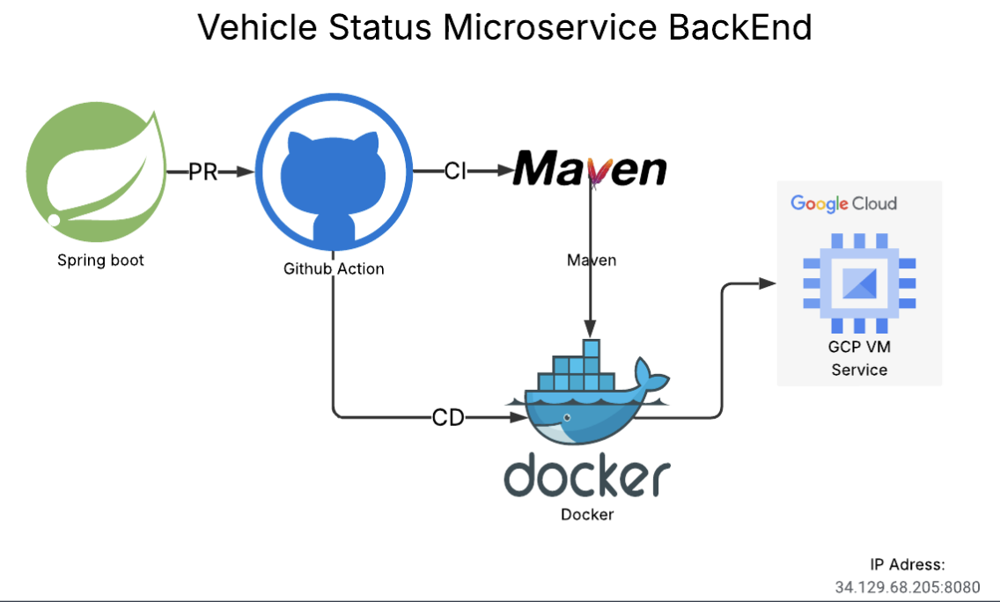

# Vehicle Status Microservice

A Spring Boot microservice for managing vehicle status monitoring and alerting, deployed on Google Cloud Platform (GCP).

## Overview

This microservice provides real-time vehicle status tracking, monitoring engine health parameters, and generating alerts based on vehicle conditions. It uses MongoDB for data persistence and includes comprehensive REST APIs for vehicle and alert management.

## Tech Stack

- **Framework**: Spring Boot 3.2.5
- **Language**: Java 17
- **Database**: MongoDB Atlas
- **Build Tool**: Maven
- **Deployment**: Google Cloud Platform (GCP)

## Features

### Vehicle Status Management
- Track comprehensive vehicle metrics including:
  - Speed and energy levels
  - Connection, task, and health status
  - Engine parameters (RPM, temperatures, pressures)
  - Engine condition monitoring
- CRUD operations by license plate or MongoDB ObjectId
- Query all vehicles or individual vehicle status

### Alert System
- Automatic alert generation based on vehicle conditions
- Alert status tracking (active/resolved/dismissed)
- Query alerts by license plate
- Filter active alerts
- Resolve or dismiss alerts

### Logging
- File-based alert logging system
- Configurable log paths and formats
- Timestamp-based log entries

## Project Structure

```
src/main/java/com/savms/
├── VehicleStatusApplication.java   # Main application entry point
├── config/
│   ├── CorsConfig.java             # CORS configuration
│   └── LogConfig.java              # Logging configuration
├── controller/
│   ├── VehicleStatusController.java # Vehicle REST endpoints
│   └── AlertController.java         # Alert REST endpoints
├── entity/
│   ├── Vehicle.java                 # Vehicle entity model
│   └── Alert.java                   # Alert entity model
├── repository/
│   └── VehicleStatusRepository.java # MongoDB repository
└── service/
    ├── VehicleStatusService.java    # Vehicle business logic
    ├── AlertService.java            # Alert business logic
    └── LogService.java              # Logging service
```

## API Endpoints

### Vehicle Status API (`/api/vehicle-status`)

| Method | Endpoint | Description |
|--------|----------|-------------|
| GET | `/all` | Get all vehicle statuses |
| GET | `/{plate}` | Get vehicle status by license plate |
| GET | `/speed/{plate}` | Get vehicle speed by license plate |
| GET | `/id/{id}` | Get vehicle status by MongoDB ObjectId |
| GET | `/exists/{plate}` | Check if vehicle exists by license plate |
| GET | `/exists/id/{id}` | Check if vehicle exists by ObjectId |
| POST | `/` | Create new vehicle status |
| PUT | `/{plate}` | Update vehicle status by license plate |
| PUT | `/id/{id}` | Update vehicle status by ObjectId |
| DELETE | `/{plate}` | Delete vehicle by license plate |
| DELETE | `/id/{id}` | Delete vehicle by ObjectId |

### Alert API (`/api/alert`)

| Method | Endpoint | Description |
|--------|----------|-------------|
| GET | `/{licensePlate}` | Get all alerts for a vehicle |
| GET | `/{licensePlate}/active` | Get active alerts for a vehicle |
| POST | `/{licensePlate}/check` | Check and generate new alerts |
| PUT | `/{alertId}/resolve` | Mark alert as resolved |
| PUT | `/{alertId}/dismiss` | Dismiss an alert |

## Configuration

### Application Properties

The service is configured via `src/main/resources/application.properties`:

```properties
# Application
spring.application.name=vehicle-status-service
server.port=8080

# MongoDB
spring.data.mongodb.uri=mongodb+srv://<username>:<password>@<cluster>.mongodb.net/<database>

# Logging
app.logging.alert-log-path=./logs/alerts.log
app.logging.enabled=true
app.logging.date-format=yyyy-MM-dd HH:mm:ss
```

### Environment Variables

For production deployment on GCP, configure the following:
- `MONGODB_URI`: MongoDB connection string
- `SERVER_PORT`: Application port (default: 8080)
- `LOG_PATH`: Path for alert logs

## Building and Running

### Prerequisites
- Java 17 or higher
- Maven 3.6+
- MongoDB Atlas account (or local MongoDB instance)

### Local Development

```bash
# Clone the repository
git clone <repository-url>
cd VehicleStatus

# Build the project
mvn clean install

# Run the application
mvn spring-boot:run
```

The service will start on `http://localhost:8080`

### Build JAR

```bash
mvn clean package
java -jar target/vehicle-status-1.0.0.jar
```

## Deployment on GCP

The microservice is deployed on Google Cloud Platform. Deployment options include:

### Google Cloud Run
```bash
# Build container image
gcloud builds submit --tag gcr.io/PROJECT_ID/vehicle-status

# Deploy to Cloud Run
gcloud run deploy vehicle-status \
  --image gcr.io/PROJECT_ID/vehicle-status \
  --platform managed \
  --region REGION \
  --allow-unauthenticated
```

### Google Compute Engine
Deploy the JAR file to a Compute Engine instance with Java 17+ runtime.

### App Engine
Configure `app.yaml` and deploy:
```bash
gcloud app deploy
```

## Database Schema

### Vehicle Collection
```json
{
  "_id": "ObjectId",
  "licensePlate": "string",
  "speed": "double",
  "leftoverEnergy": "double",
  "connectionStatus": "int",
  "taskStatus": "int",
  "healthStatus": "int",
  "engineRPM": "int",
  "lubeOilPressure": "double",
  "fuelPressure": "double",
  "coolantPressure": "double",
  "lubeOilTemp": "double",
  "coolantTemp": "double",
  "engineCondition": "int"
}
```

### Alert Collection
- Stores vehicle alerts with status tracking
- Links to vehicles via license plate or ObjectId

## Logging

Alert logs are stored in `./logs/alerts.log` by default. Log format:
```
[yyyy-MM-dd HH:mm:ss] Alert message
```

## CORS Configuration

CORS is enabled for cross-origin requests. Configure allowed origins in `CorsConfig.java`.

## License

This project is part of the SAVMS (Smart Autonomous Vehicle Management System).
